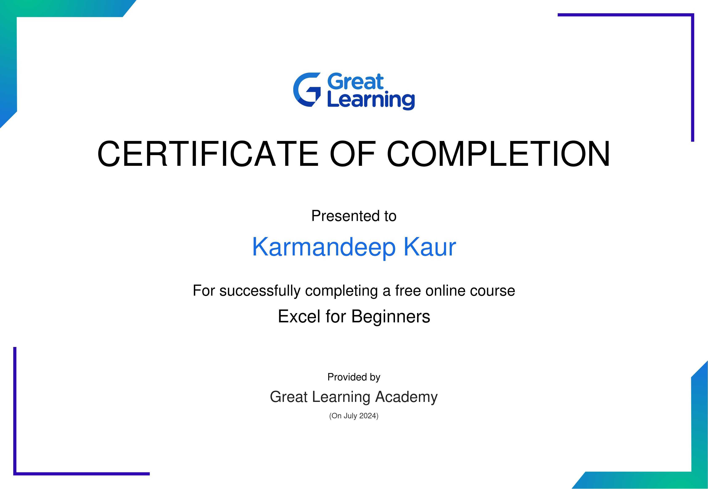

# Karmandeep108Kaur.github.io

# My Portfolio
Hi everyone, my name is Karmandeep Kaur. I was born in 2006 and live in Ludhiana, Punjab since then. I have passed my 10th and 10 + 2 from Partap Public School, Ludhiana. I am currently pursuing my BTech in Computer Science and Engineering from Guru Nanak Dev Engineering College with the aim of becoming a Software Engineer in a renowned company. I cherish reading books in my leisure time and love to explore new things when it comes to technology. I know basics of python and currently pursuing my Java and Excel course from Guru Nanak Dev Engineering College. 

### My Excel Certificate

## Academics

| Academics|Year|Score |
|---|---|---|
| 10th Grade | 2022 | 94.5 % |
| 12th Grade | 2024 | 91.4 % |

## Activity Report Student Induction Program 2024

### My 1st Day at GNDEC
Today was the first day of our college journey at Guru Nanak Dev Engineering College. We started or day by praying at college Gurudwara Sahib which was a cherry on cake for our first day of college. Today various faculty members including old principle sir of Guru Nanak Dev Engineering College who was also an alumnus of the same college encouraged us on the first day of our college with their words of wisdom and give an important message “no tension and full attention”. Various other alumni also share there invaluable experience with the freshers in which they made us aware about various mistakes that they and there college mates had done at the time of their own college. In a nutshell be completely enjoyed are first day of our college journey by gaining fruitful knowledge.

### My 2nd Day at GNDEC
Today we came to know more about our Guru Nanak Dev Engineering College. Our professors gave us detailed information about GNDEC and also motivated us at the same time. They told us about various National and International societies and clubs going on in the college, number of canteens and playgrounds in the college, activities going on in college, Hostel facilities, certain upcoming activities etc. Here we also came to know about various scholarships schemes that our college offers . And all this was explained through interesting PPTs which made it way more interesting. 

### My 3rd Day at GNDEC

| SNo. | Date | Teacher | Description |
|---|---|---|---|
| 1 | 12 July 2024 | Miss Sandeep Kaur | Miss Sandeep Kaur taught us maths for the induction program. She started the class by taking introduction of each and every student. Furthermore she made us recall certain concepts of 10 + 2 and gave us a unique way of understanding. She also added some new concepts which we did for the first time but with utmost clarity. She gave us questions so that we can learn about the practical application of formulas. She was always open for doubts. Her session was awesome. |
| 1 | 12 July 2024 | Miss Manjot Kaur | Miss Manjot Kaur taught us Universal Human Values. She explained us in detail that how to become a good human. She made us understand various aspects of Universal Human Values like aspirations, happiness, harmony, value education etc. Her way of teaching and explaining was undoubtedly commendable, which made us understand various deeper concepts of this subject with ease. Each one of us enjoyed her session as she guided humbly us whenever we had doubts. |  
 
### My 4th Day at GNDEC

| SNo.| Date | Resource Person | Description |
|---|---|---|---|
|1| 15 July 2024 | Dr.Pyarelal Garg | Dr. Garg shared his invaluable thoughts with the students. He emphasized on theoretical as well as practical knowledge. He adviced the students to get rid of all the "ifs and buts" in there life and be focused. He added that one should be a man of his own words , sweet spoken and modest in order to become a good human. Furthermore, he stressed on the fact that "Education is eternal".He concluded his speech with a beautiful message that one should always do self introspection and not get persuaded by others. His words of wisdom would forever be imprinted on my heart.|
|2| 15 July 2024 | Sony Goyal | Mr. Soni Goyal explained in detail that how to plan your 4 years of Engineering. His session mantra to start was “One Two Ka Four”. He questioned the students that why do they say non-medical instead of science stream and urged them to use the latter one. During his session he gave two important messages. The first one is that give 100% in everything and do one work at a time with complete focus. Second one says that learn by heart and soul and not merely by brain. His session was entertaining, captivating as well as knowledgeable at the same time. Everyone enjoyed his session and would remember his words forever in the lives.|
|3| 15 July 2024 | Mr. Pancham | Mr. Pancham started his speech with a unique entry in the auditorium where he started with a short story in order to enlighten the students about the topic. His knowledge about communication skills was commendable. He explained in detail that how to understand face expressions and gestures. The way in which he made the students understand the communication skills was completely unique. He also told the students about society which he leaded. His session was quite inspiring. |

### My 5th Day at GNDEC 

**1. Code GNE**
Today was another amazing day at Guru Nanak Dev Engineering College our day started
with Code GNE class with Hardeep Rai sir he shared his fruitful knowledge with us. He took
doubts from the students and solved them publicly so that everybody can understand. His
technical skills are phenomenal and I had an amazing experience in his class.

**2. Quiz**
Then we marched towards seminar hall for quizzes. The first quiz was based on English
Communication Skills with two teams competing with each other. It was highly
knowledgeable and there were various things which we heard for the first time. Second one
was based on general knowledge in this quiz we got the opportunity to know about various
eminent personalities. Both the quizzes were interactive and we got the chance to know our
teachers as well as peers.

### My 6th Day at GNDEC 

| Date | Event | Description |
|---|---|---|
| 17th July 2024 | Maths Class by Miss Sandeep Kaur | In today's maths class Sandeep ma'am gave us different questions from differentiation and integration, we solved those questions and asked our doubts. We all were having a good time solving questions with our peers. Everything was going good when me and my friend realised that we were in the wrong section for the past one hour. Fortunately our section also had maths class so we were able to manage our work. But still we enjoyed the entire class. |
| 17th July 2024  | UHV Class by Miss JK | Today was our second UHV class in which ma'am enlightened us about the topic understanding the human being as coexistence of self and body. We also learn how to distinguish between self and body and how to maintain a balance between the two. The way JK ma'am explain us was phenomenal. She also interacted with us one on one by asking our introduction and takeaways from the lesson at the end of the class. We also had an English test after this class. | 
| 17th July 2024 | Code GNE Class by Mr. Hardeep Rai | Our 6th day at college ended with another amazing session with Hardeep Rai sir, who always try to tell new things each time we have a session. Today we learnt that how we can make ourselves independent in terms of technology and advancement. His way of teaching is completely different from others but however is unique and highly beneficial. |

### My 7th Day at GNDEC 

**1. Peer interaction**
Our day started with the peer interaction, in which our seniors gave us a detailed information about our college exams. They explained us all the guidelines of the examinations. We also learnt that how to calculate SGPA and CGPA. Our seniors were interactive and polite while answering our queries. 

**2. Maths class by Ms. SKG**
Further we had our maths class with Sandeep Kaur ma'am. She gave us new questions of differentiation and integration to solve in the class. Whosoever solved the question first was called to solve the same question on the blackboard. She also helped us in solving our doubts from the previous lecture. 

3. Lecture by ANO-NCC Dr. Harwinder Singh 
Moving forward Dr. Harvinder Singh enlightened us about NCC and its importance. He explained about different type of activities mainly academic, co-curricular and extra curricular. He also talked about grabbing the opportunity and emotional intelligence. 

4. Lecture by Coordinator-NSS Er. Jasvir Singh Grewal 
To begin with, he told us about the importance of extraordinariness. He further explain about the real meaning behind engineering and reverse engineering. We also learnt the difference between scientist and engineer and man machine relation. To conclude with, he made us aware of the depreviating quality of water and air quality index and also inspired us to work for the society which is the main moto of NSS. 

### My 8th Day at GNDEC

1. Lecture by Er. Kanwardeep Kalra
Ms. Kanwardeep Kalra started started her interactive session with the slogan “Sooner the Better”. She displayed beautifully, what happens in an interview through various plays. Further she talked about the importance of soft skills along with hard skills. She gave us another slogan “Changes Never Easy But it is Worth”, which would forever be imprinted on our hearts and souls. We also learnt about networking and its importance through this session. 

2. Lecture by Jaswinder Singh IAPT in charge 
Mr. Jaswinder Singh give us a unique understanding about all the hard and difficult concepts of Physics, Mathematics, Chemistry and Biology. The audience was extremely thrilled by learning the tricks of counting the bones in human body and various other calculation tricks. With each and every trick he also gave us a message about saving environment and spreading knowledge. His humorous way of explaining the concepts made the interaction way more interesting and captivating. 

3.Department visit 
For our department visit, we all assembled near the MBA block. From there, we headed towards our classrooms with our teachers. After that we started our journey to explore our Computer Science and Engineering department. We visited various labs, libraries and server rooms, after which we again gathered in the same classroom where we started. Here we had a brief session with our HOD Ms. Kiran, who warmly welcome us into the department and motivated us for our four years journey.

4. Workshop 3 
It was my first experience, conducting any workshop in college. Our workshop was based on Pandoc and it's applications. To begin with, I gave the introduction about Pandoc. Followed by Sharandeep Kaur, who enlightened the audience about the installation process. Furthermore, Harleen Kaur and Kamaljeet Kaur skillfully demonstrated the conversion of a markdown file to HTML and DOCS. Then Akshay explained the difference between the files processed with and without standalone function. Last but not the least, Ishmeet Singh, team leader, explain how to convert markdown file to ebook through an application named calibre. All the team members were highly supportive and polite. I learnt various things from them.

### My 9th Day at GNDEC 

1. Lecture by Dr. SB Singh 
A day started with a self introspection session with the Dr. SB Singh aka the former principal of GNDEC. In this session, he made us write our name and personal information, followed by our hobbies, goals, weaknesses and strengths, dreams and our commitments with ourself on a piece of paper. This session made me realise my priorities and goals in life. 

2. Lecture by Dr. Pushpinder Singh 
To start with, Dr. Pushpendra Singh entertained the audience with the captivating story of Hare and the Tortoise. It was interesting to know that the story which we have been told in the childhood has been modified by adding another three parts to it with each and every part having its own meaning and message for life. Furthermore, he emphasised on various methods of learning adopted by different types of students. From this session I learnt that it is necessary to compete with ourselves and not others. 

3. Causmic Club
Finally our seniors told us about the importance, hierarchy system and different types of activities conducted by causmic club. We had the chance to meet various members of this club who guided us about different events of the same. Here, we came to know about the biggest function of college known as APEX, which is also organised by causmic club. Different members explained us about the features and the benefits of causmic club in skill building.

### My 10th Day at GNDEC 

1. Chemistry class by Mr. Karan Bhalla 
Mr. Karan started the class with three basic lessons of life discipline, punctuality and making notes in class. He further made us aware about the courses like NPTEL, MOOCS, SWAYAM and MHRD. Today we worked on building our foundation of Organic, Physical and Inorganic Chemistry. He emphasised on the fact that basic concepts should be cleared well in time. Right from the beginning he was very clear and energetic. 

2. Peer Interaction (Technical)
In this session we worked with our seniors to brush up our technical skills related to Excel, Chat GPT and Artificial Intelligence. We were extremely thrilled to see the technical knowledge of our seniors which they passed on to us. We learnt various commands of Excel, how to use chat GPT smartly for our college work and the difference between Normal AI and Generative AI. To conclude with, they taught us another interesting concept known as Mail Merging.

### My 11th Day at GNDEC 

1. Lecture by Mr. Gauravdeep Singh
Mr. Gaurav first made the environment humorous by narrating real life story about him and his colleagues. Along with the story he also shared with us invaluable lessons that he learnt at various stages of his life. The first lesson was find your quality, followed by the second one which says power of universe lies in you and the last but not the least says that God always does the best. Towards the end of the session, he made the environment quite serious when he talked about the mistakes which he had his done in his life. In a nutshell, he left a positive impact on each and every student through his life journey. 

2. Lecture by Er. Lakhveer Singh
We were quite fortunate that we had your opportunity to know about Centre of Multifaceted Learning by Er. Lakhveer Singh. He emphasised on the importance of CML and how it can benefit a student's life in a long run. He talked about various research activity managed by CML, in which students can participate in order to brush up their skills. He also taught us about various societies and how we can benefit the society. 

3. Causmic Club
Then Causmic Club members took the stage. We got the opportunity to meet various teams such as technical team,creative team and managing team of causmic club. The members talked about various prominent events that are going to happen in 2024 and also that first year students are going to organise those events. They also assured us that when ever we become across a trouble, they are always there to help us whether we are from causmic club or not. 

### My 12th Day at GNDEC 

1. UHV Class by Ms. Manjot Kaur 
In today's class we revised all the topics which have been discussed in the previous classes. Ms. Manjot taught us another chapter of UHV subject, which is Understanding Harmony in Family. She emphasized on various feelings which we need in relationship such as Trust, Respect, Affection, Guidance, Reverence, Glory, Gratitude, and Love. She also discussed about the difference between natural acceptance and competence. Every time we attend UHV class, we always learn new things about Humanity and Brotherhood. 

2. Peer Interaction
We were lucky enough to have the chance to interact with our seniors, who taught us various advance concepts of technology. Today we learn about “Canva” and it's amazing features that can help us. We came to know that how we can edit a poster which was very interesting to know about. Finally came the most interesting part of today's session in which our senior taught us how to generate QR code. I also generated the QR code of my get hub account. We also designed a poster which we uploaded on the Google Form provided by our seniors. 

3. Maths Test 
Our day ended with the maths test conducted by Ms.Manjot Kaur. For the test we all assembled in the English lab after the break. Whenever we give the test we always get the chance to learn new things. We all gave our test with utmost sincerity and honesty. 

### My 13th Day at GNDEC 

Validatory 

Today marks the end of this incredible journey of Induction Program 2024. Our day started with an informative and relaxing meditation session with Dr.Kanwalpreet Kaur Bhatt. She talked about the entire process of meditation in a detailed manner. We also had a 15 minute meditation session with her in which she guided us at each and every step. 
After the meditation session there were music and dance performances. Some also did mimicry which was very interesting to see how they narrated hilarious incidents and mimicked different voices. Finally, we reached the end of the Induction Program 2024, in which we all enjoyed as well as a loan to various invaluable insights which will forever be imprinted on our heart and soul. 

### Reflection

During our 13 day journey of Student Induction Program 2024, we got the  opportunity to listen to various real life experiences of different guest speakers and faculty members. Also we came across various new things which we heard for the first time in our life. I personally came across various life changing lessons and experiences which I would remember forever. All all these meaningful insights and practical knowledge will be quite useful in the upcoming four years journey. I'm highly grateful to be able to attend this 13 day programme. 

 

